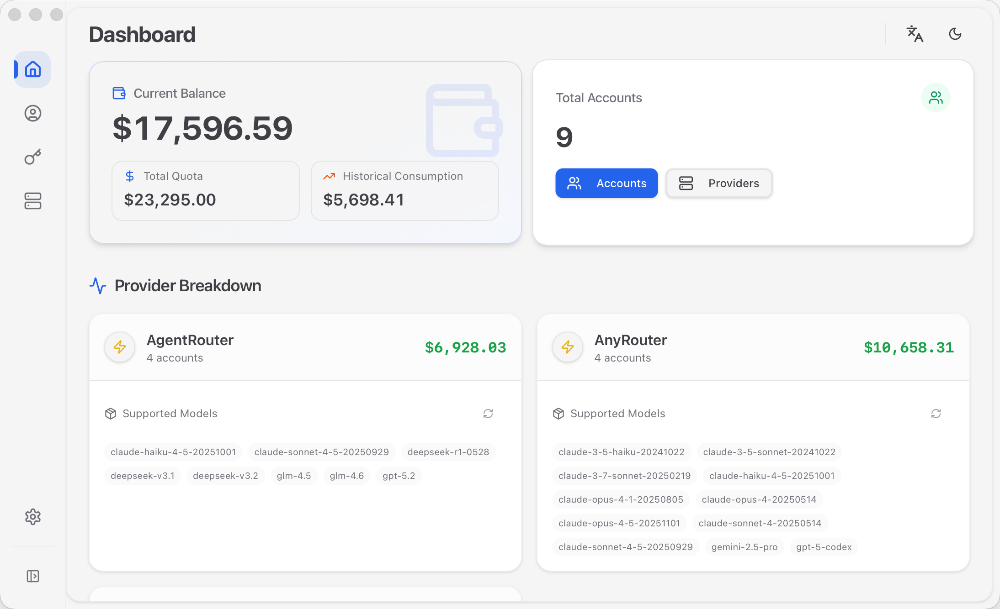
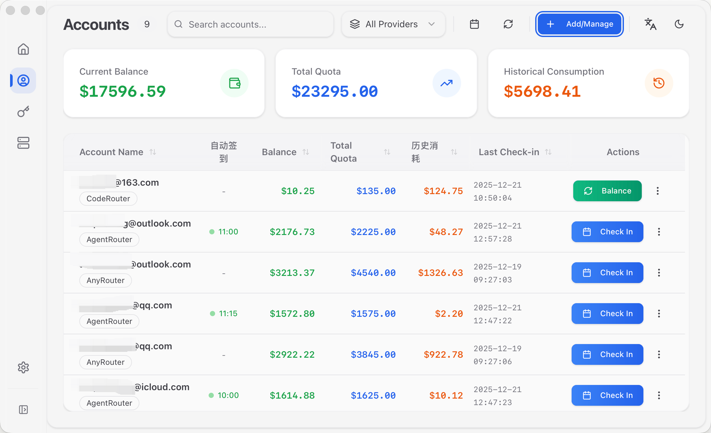
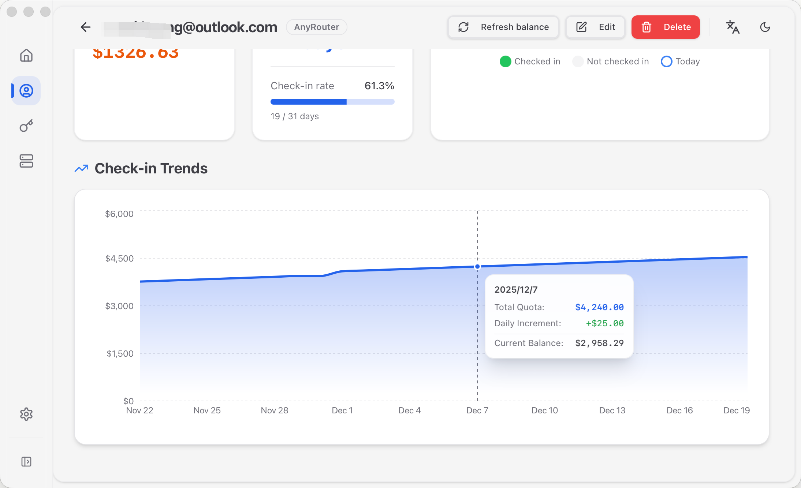
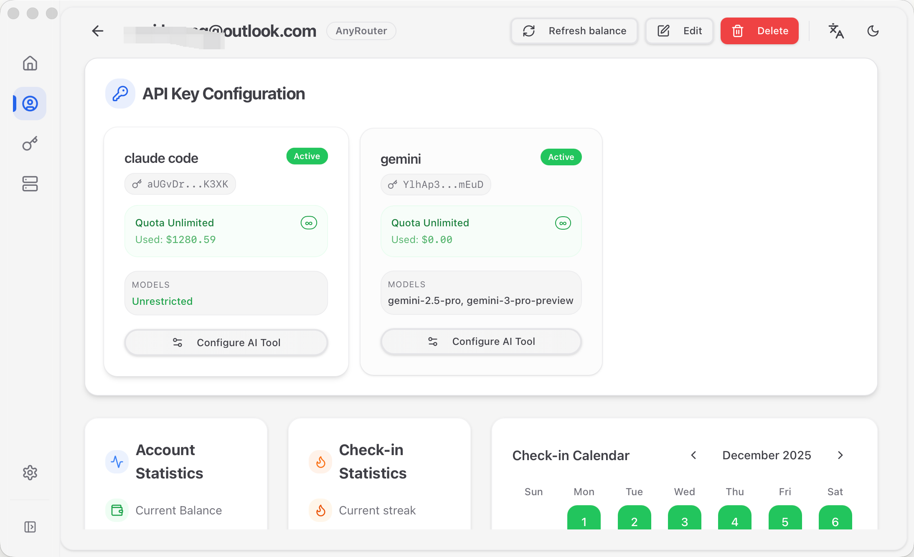

# Getting Started

## What is NeuraDock?

NeuraDock is a modern automatic check-in management system built with **Tauri 2 + Rust + React**. It helps you manage multiple service provider accounts, automate daily check-ins, and track balance history.

## Key Features

- **Multi-Account Management**: Manage accounts across different service providers (AnyRouter, AgentRouter, etc.)
- **Automatic Check-In**: Schedule daily check-ins at specified times with configurable intervals
- **Balance Tracking**: Monitor quota usage and balance history with provider-level statistics
- **Check-in Streaks**: Streak statistics, calendar view, trend analysis, and monthly overview
- **Token Manager**: Configure tokens for Claude Code/Codex AI tools with custom node support
- **Batch Update**: Import and update multiple accounts via JSON with optional "create if missing" mode
- **WAF Bypass**: Automatic Cloudflare protection bypass using browser automation
- **Session Caching**: Reduce browser automation overhead with intelligent session management
- **Proxy Configuration**: In-app proxy settings (HTTP/HTTPS/SOCKS5)
- **Cross-Platform**: Runs on macOS, Windows, and Linux

## What's New in v0.5.0

### Advanced Check-in Analytics
View monthly check-in overview, trend charts, and quota changes to quickly identify missed check-ins and quota spikes. Calendar view supports deep-linking - click on any date to jump to detailed records.

### Batch Account Management
Use the new BatchUpdateDialog to import or update large batches of accounts at once. Supports JSON format with optional "create if missing" mode, simplifying large-scale account synchronization.

### Enhanced Notifications
Feishu notifications now include complete "yesterday vs today vs change" comparison information. Automatically falls back to the most recent record when historical data is missing, ensuring notification availability.

### Performance Improvements
Startup time reduced by ~40%, frontend initial load time reduced by ~30%. Application is more responsive with lower resource usage.

## Screenshots

### Dashboard

*View overall balance statistics and model lists by provider*

### Account Management

*Manage multiple provider accounts, perform check-ins and balance refreshes*

### Check-in Streaks

*View streak statistics, calendar view, and trend analysis*

### Token Manager

*Configure API tokens for AI tools*

## Quick Start

1. **Download the latest release** from the [Releases](https://github.com/i-rtfsc/NeuraDock/releases) page

2. **Install the application**:
   - **macOS**: Open the `.dmg` file and drag NeuraDock to Applications
   - **Windows**: Run the `.msi` installer
   - **Linux**: Run the `.AppImage` file

3. **Launch NeuraDock** and add your first account

4. **Configure auto check-in** (optional) to automate daily check-ins

## System Requirements

| Platform | Minimum Version |
|----------|----------------|
| macOS | 10.15 (Catalina) or later |
| Windows | Windows 10 or later |
| Linux | Ubuntu 20.04 or equivalent |

**Additional Requirements**:
- A Chromium-based browser (Chrome, Edge, Brave) installed for WAF bypass functionality

## Next Steps

- [Installation Guide](./installation.md) - Detailed installation instructions
- [Configuration](./configuration.md) - Configure your accounts and settings
- [User Guide](./user_guide/README.md) - Complete usage documentation
