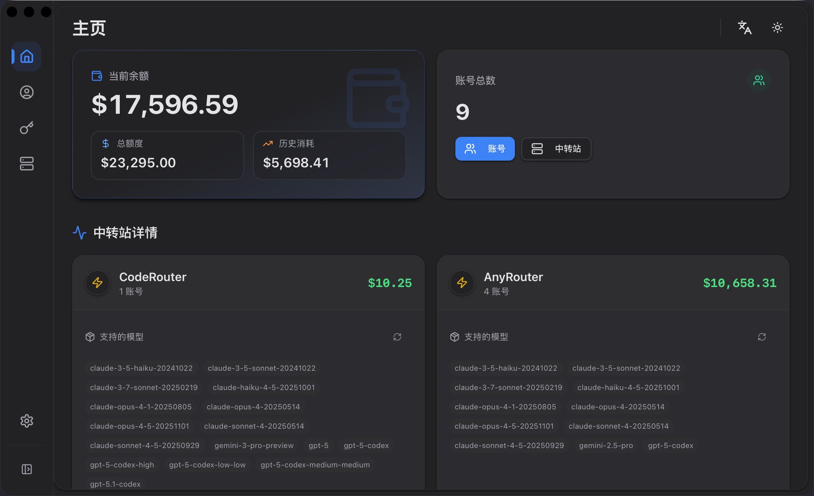
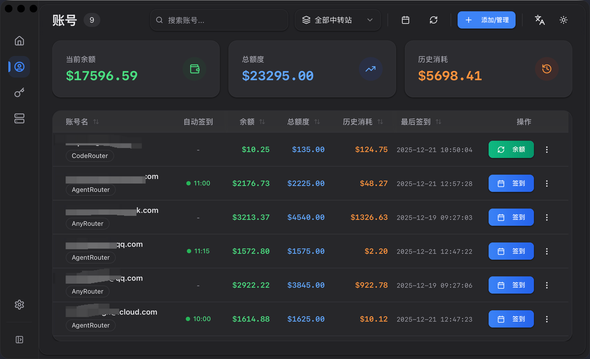
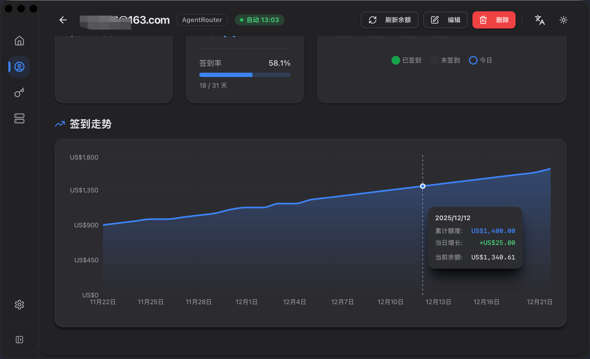
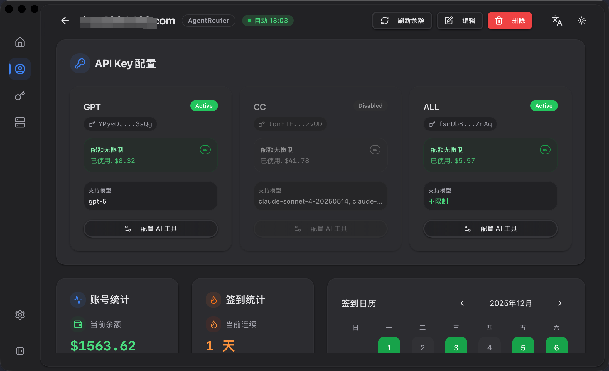

# 快速入门

## 什么是 NeuraDock？

NeuraDock 是一个现代化的自动签到管理系统，基于 **Tauri 2 + Rust + React** 构建。它帮助你管理多个服务商账号、自动执行每日签到、追踪余额历史。

## 核心功能

- **多账号管理**：管理不同服务商的账号（AnyRouter、AgentRouter 等）
- **自动签到**：在指定时间自动执行每日签到，支持可配置签到间隔
- **余额追踪**：监控配额使用情况和余额历史，支持 Provider 级统计
- **签到记录**：连续签到统计、日历视图、趋势分析、月度概览
- **Token 管理**：为 Claude Code/Codex 配置 API Token，支持自定义节点
- **批量更新**：支持 JSON 导入批量更新账号凭证，可选"不存在则创建"策略
- **WAF 绕过**：使用浏览器自动化自动绕过 Cloudflare 保护
- **会话缓存**：智能会话管理减少浏览器自动化开销
- **代理配置**：支持应用内代理设置（HTTP/HTTPS/SOCKS5）
- **跨平台**：支持 macOS、Windows 和 Linux

## v0.5.0 新特性

### 高级签到分析
查看月度签到概览、趋势图和收益变化，快速定位断签和配额波动。日历视图支持深度链接，点击日期即可跳转到详细记录。

### 批量账号管理
使用新的 BatchUpdateDialog 一次性导入或更新大量账号。支持 JSON 格式，可选"不存在则创建"模式，简化大规模账号同步。

### 增强通知
飞书通知现在包含完整的「昨日 vs 今日 vs 变化」对比信息，在历史数据缺失时自动回退到最近记录，确保通知可用性。

### 性能提升
启动时间减少约 40%，前端首次加载时间减少约 30%。应用响应更快，资源占用更低。

## 界面预览

### 仪表盘

*查看总体余额统计和各服务商的模型列表*

### 账号管理

*管理多个服务商账号，执行签到和余额刷新*

### 签到记录

*查看连续签到统计、日历视图和趋势分析*

### Token 管理

*为 AI 工具配置 API Token*

## 快速开始

1. **下载最新版本** 从 [Releases](https://github.com/i-rtfsc/NeuraDock/releases) 页面

2. **安装应用**：
   - **macOS**: 打开 `.dmg` 文件，将 NeuraDock 拖入 Applications
   - **Windows**: 运行 `.msi` 安装程序
   - **Linux**: 运行 `.AppImage` 文件

3. **启动 NeuraDock** 并添加你的第一个账号

4. **配置自动签到**（可选）以自动执行每日签到

## 系统要求

| 平台 | 最低版本 |
|------|---------|
| macOS | 10.15 (Catalina) 或更高 |
| Windows | Windows 10 或更高 |
| Linux | Ubuntu 20.04 或同等版本 |

**额外要求**：
- 需要安装 Chromium 内核浏览器（Chrome、Edge、Brave）以支持 WAF 绕过功能

## 下一步

- [安装指南](./installation.md) - 详细安装说明
- [配置指南](./configuration.md) - 配置账号和设置
- [用户指南](./user_guide/README.md) - 完整使用文档
